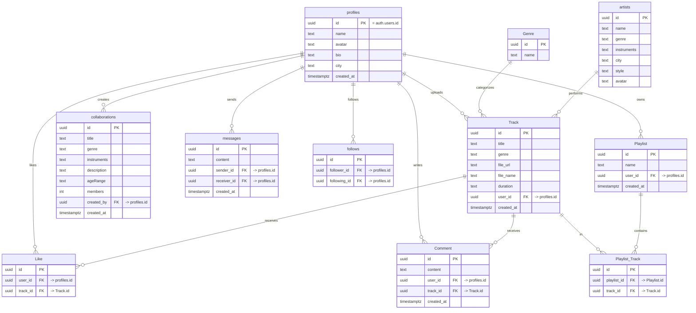

# 🗄️ ERD — מודל הנתונים של LIZI / LIZI Database Model

תרשים ישויות-קשרים (Entity-Relationship Diagram) של בסיס הנתונים ב-Supabase (PostgreSQL).

> **הערה:** תרשים זה מבוסס על הסכמה בפועל ב-Supabase. לתרשים אינטראקטיבי מלא ומדויק ניתן גם להפיק צילום מ-**Supabase Dashboard → Database → Schema Visualizer**.

---

## תרשים ERD (Mermaid)

---

## הסבר על הקשרים / Relationships

| קשר / Relationship | סוג / Type | הסבר |
|---|---|---|
| `profiles` → `Track` | 1:N | משתמש אחד יכול להעלות מספר שירים |
| `profiles` → `collaborations` | 1:N | משתמש אחד יכול ליצור מספר פרויקטים |
| `Genre` → `Track` | 1:N | ז'אנר אחד מסווג מספר שירים |
| `Track` ↔ `Playlist` | N:M | דרך טבלת הקישור `Playlist_Track` |
| `profiles` ↔ `profiles` | N:M | מעקב הדדי דרך טבלת `follows` |
| `Track` → `Like` / `Comment` | 1:N | שיר מקבל לייקים ותגובות מרובים |

---

## אבטחת גישה / Row Level Security (RLS)

הופעלו מדיניויות RLS על הטבלאות הרגישות:

- **`Track`** — כל משתמש **מחובר** (`authenticated`) יכול לקרוא את כל השירים (פיד קהילתי), אך רק הבעלים (`auth.uid() = user_id`) יכול להוסיף / לעדכן / למחוק.
- **`collaborations`** — כל משתמש מחובר יכול לקרוא את כל הפרויקטים; רק היוצר יכול לערוך.
- **Storage bucket `tracks`** — רק משתמשים מחוברים יכולים להעלות לתיקייה שלהם; קריאה ציבורית לצורך השמעה.
- אורחים **לא מחוברים** אינם מקבלים גישה לתוכן דרך ה-API (deny-by-default).

> תרשים זה תואם למבנה בפועל ב-Supabase, כולל מפתחות ראשיים (PK), מפתחות זרים (FK), וטיפוסי הנתונים.
